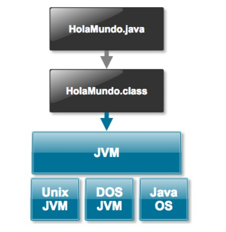
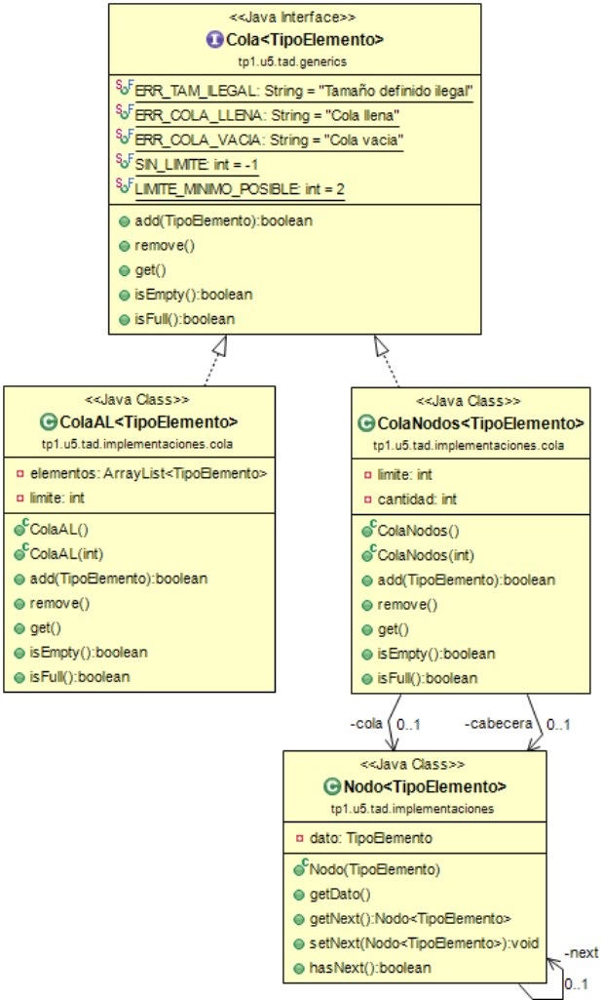

# Java 🚀️

* ¿Tengo Java instalado? Ir al cmd y correr un`java -version` y la misma, si tenemos Java configurado, nos mostrara la version actual.

# Características ❤️

* Es un lenguaje Case-Sensitive. Toda sentencia finaliza con punto y coma.
* Al principio Java fue llamado Oak, y fue creado por la empresa Sun, antes de la explosión de internet. Busco una interfaz más cómoda, un lenguaje más fácil de usar y diversidad para escribir un código que funcione para varios dispositivos
* El mismo código es multiplataforma. También, si tenes un browser compatible con Java, se puede ejecutar cualquier aplicación en la misma.
* Es orientado a objetos.
* Esta hecho en base a C++, pero Java es mas rápido de aprender y maneja mejor cuestiones de gestión de memoria.
* No es tan rápido como C por su tipo de lenguaje Byte Code que debe ser traducido en cada PC que compilará el lenguaje.
* Todas las clases de Java heredan de la clase base, `Object`.
* **Punteros** -> En Java no existen punteros (Invocar tipos de memoria), estos causaban muchos errores de compilación en C.
* **Variables Globales** -> Lo único global en Java son los nombres de las Clases. Las variables pueden cambiar según lo deseado.
* **Sentencias Goto** -> Sentencias que rompen la estructura del programa. Java reemplaza estos con `break` y `continue`.
* **Asignación Memoria** -> En C y C++ había que reservar memoria y luego liberarla cuando ya no era usada. Java posee un **Garbage Collector** que permite al programador olvidarse de estas gestiones.
* Al principio Java fue llamado Oak, y fue creado por la empresa Sun, antes de la explosión de internet. Busco una interfaz más cómoda, un lenguaje más fácil de usar y diversidad para escribir un código que funcione para varios dispositivos.

### Buenas practicas de Sintaxis

* Nombres de clases -> `NombreClase`
* Nombres Variables -> `nombreVariable`
  Solo puede contener letras, numeros (No pueden comenzar con un numero), guion bajo y "$". No puede contener espacios.
* Metodos -> `nombreMetodo()`

Proceso de compilacion. ❤️

1. **Crear** nuestro nuevo archivo  `.java`
2. **Compilar** nuestro archivo, ya que debe ser comprendido por la maquina virtual. Esto con `javac nuestroproyecto.java`. Esto generara un archivo del mismo nombre pero con la extension `.class`. Esto es el codigo binario.
3. **Ejecutamos** el proyecto con `java nuestroproyecto`

**¿Qué es la Java Virtual Machine? (JVM)?**
Gracias a la JVM, cualquier programa Java es ejecutable de forma multiplataforma. Es una VM que unifica todo.

## Estructura del Programa ❤️

`public class HolaMundo {}` -> Clase principal que contendra a nuestro programa.
`public static void main(String[] args){}` -> Metodo main. `args` hace referencia a argumentos. El metodo main es nuestro entry point.
`System.out.println("Hola Mundo!")` -> Sentencia ejecutada cuando el programa esta corriendo.

## Variable ❤️

Una variable es un espacio en memoria que puede almacenar un valor o un dato.

* Es un dato que se pierde cuando el programa acaba. La unica manera de "guardarlo" es si lo almacenamos en una BD.
* Debo de estar conciente, al momento de declarar mi variable, que tanto puede crecer.
* Un atributo `static` mantendra la unica instancia para todos los objetos de la misma clase y de las subclases.

En Java hay varios tipos de variables, conocidos como **datos primitivos** como por ejemplo:

* booleano -> `boolean`
* byte -> `byte` (-128 a 127)
* Entero corto -> `short` (-32,768 a 32,767)
* Entero -> `int` (Cualquier numero entero)
* Entero Largo -> `long` (Numeros aun mas grandes que el int)
* Doble -> `double` (Incluye decimales)
* Flotante -> `float` (Es mas pequeño que double)
* Caracter -> `char` (Caracteres)

Tambien estan los tipos de datos **Abstractos** que son creados por el desarollador mismo.

**¿Cómo declaro una variable?**
`tipoDeVariable nombreVariable = valorDeVariable;`
`int miNumero = 10`
`int variable1, variable2, variableConValor = 3;`

# Tipo Abstracto de Datos (T.A.D) ❤️

Esta compuesto de una estructura donde se guardan los datos y un conjunto de metodos que hacen respetar ciertas reglas de modelado de datos (Como quiero tratar a los datos).

* Surge del **tipo abstracto de dato**, es la evolucion de la estructura de datos, como el vector.

## Ejemplo

Necesito guardar un conjunto de 5 enteros que se mantengan siempre ordenados, tanto al eliminar como al agregar uno nuevo.

**Solucion** -> Guardo estos datos en un vector de 5 enteros, y defino dos metodos, `agregarNumero(int numero)` y `eliminarNumero(int numero)`. Al usar un vector, utilize un **Tipo abstracto de Dato**.

**Estructura** -> El vector
**Metodos para modelar los datos** -> Los dos metodos
**Regla a Respetar** -> Que los numeros se mantengan ordenados

## Colas

**Regla** -> Es una estructura FIFO (First In, First Out), los elementos se sacan en el mismo orden en el que fueron agregados.

Se puede implementar de 2 maneras:

**Usando un ArrayList** -> Debemos agregar los elementos al final con el propio `add()` del arrayList, siempre sacando el primer elemento usando el `remove(0)` y chequear si la cola esta vacia con `isEmpty()`

**Con nodos** -> Puede parecer mas complicada pero es mas simple y eficiente. Con esta implementacion no se produce el desplazamiento interno de todos los elementos del ArrayList cuando se saca al primer elemento.

Creamos la cola:

`Cola<Persona> filaDePasajeros = new ColaNodos<>();`

Agregamos a una persona a la lista:

`filaDePasajeros.add(new Persona());`

Vemos los elementos disponibles:

`System.out.println("Primera persona en la lista" + filaDePasajeros.get());`

Quitamos o vemos al primer elemento en la fila:

`filaDePasajeros.remove()`

## Pilas

Es un tipo abstracto de dato que debe simular el comportamiento de una Pila en la vida real.

**Regla** -> El ultimo que entra es el primero que sale (L.I.F.O)

**Metodos de Modelado** -> `apilar()`, `desapilar()`, `estaVacia()`, `estaLlena()` (Si definimos un limite). Los metodos, sin embargo, suelen llamarse `push(), pop() y peek()`.

Se puede implementar de manera similar a la cola.

Creamos la cola:
`Pila<Caja> pilaDeCajas = new PilaNodos<>();`
Agregamos una caja a la pila:
`pilaDeCajas.push(new Caja());`
Vemos los elementos disponibles:
`pilaDeCajas.peek();`
Sacamos la primera caja:
`pilaDeCajas.pop();`

## Nodo vs Dato

No hay que confundir al **nodo con el dato**. El nodo es el contenedor circunstancial del dato. No se puede acceder a la cadena de nodos. 

