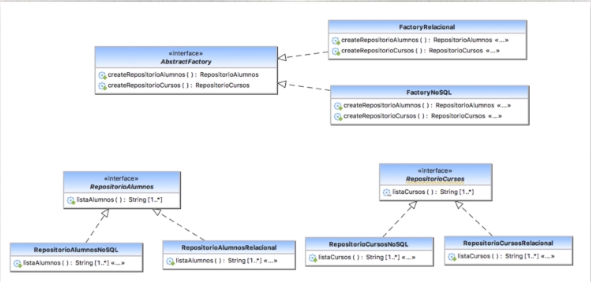
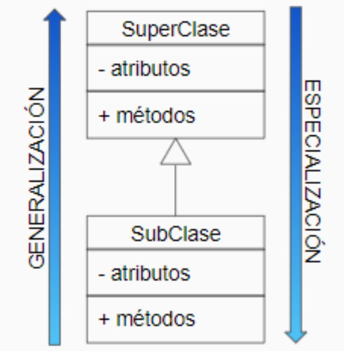
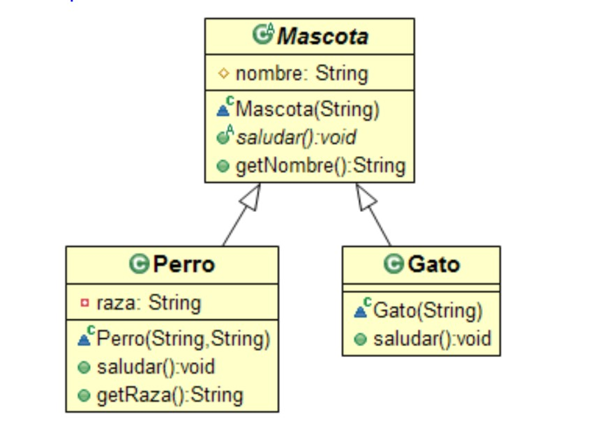
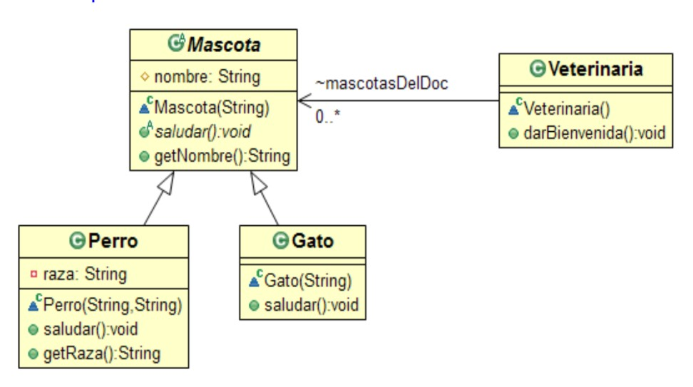

# SOLID, Orientación a Objetos y Java ❤️

Este repositorio esta hecho tomando como base el siguiente curso de Udemy => https://www.udemy.com/course/patrones-de-diseno-y-principios-solid/ .

* Recomiendo abrir los proyectos en Eclipse.
* ¿No sabes Java? Recomiendo ir al archivo "Java" que se encuentra en este mismo repositorio

## Origen

Son principios que formaban parte de un libro de "Desarrollo Agil de Software", escrito por "Uncle Bob", un autor de varios libros importantes en técnicas de programación.

* S -> Single resposibility Principle
* O -> Open/Closed principle
* L -> Liskov Substitution Principle
* I -> Interface Segregation Principle
* D -> Dependency Inversion Principle

## Single Responsibility Principle - Principio de Responsabilidad Unica.

* Variación de Cohesión. Cada clase debería tener una única responsabilidad, y así será mas fácil de mantener.
* Cohesión -> El grado en que el contenido de un modulo esta relacionado entre si. (Si el modulo tiene 1 sola responsabilidad, la cohesión es alta).
* Mantebilidad y Reusabilidad.
* "Una clase debería tener 1 sola razón para cambiar".
* En un mismo método mezclamos lógica de negocio y lógica de presentación -> Violación de cohesión. Se deberían crear 2 clases diferentes para cada responsabilidad diferente.

## Open Closed Principle

* Estamos diseñando un sistema que será modificado en el futuro.. ¿Nuestro diseño puede recibir cambios o ser extendido?.
* Nuestras entidades (Clases, módulos, etc..) deben ser abiertas para extenderse pero cerradas para ser cambiadas. No se debe modificar el código ya existente en la extensión.
* Por ejemplo, si tenemos la entidad Pintor, que debe pintar figuras, y cada figura se pinta de manera distinta, nos conviene extender cada figura a una clase figura general, y que la misma tenga un método abstracto que sea "pintar()" para que cada una de las figuras la implemente a su manera en la clase.

```java
interface Figura{
void pinta();
}

-----------------------------

class Cuadrado implements Figura {
  @Override
  public void pinta(){
  //Como pintamos el cuadrado
  }
}

---------------------------------
class Circulo implements Figura {
  @Override
  public void pinta(){
   //Como pintamos el circulo
  }
}
```

## Liskov Substitution Principle 👀️ 

* Al sobreescribir un metodo debemos asegurarnos de que este mantenga el espiritu original. Una clase derivada debe comportarse lo mas parecido posible (o igual) a la clase base. Un `abrirPuertas()` sobreescrito no deberia abrir una ventana cuando su proposito original era abrir puertas. 

* `T obj = new T();` y `T obj = new S()`, S seria un subtipo de T. Todas las propiedades que el programa requiere de T, también se deberían cumplir en S.
* `Integer[] array` y `Object[] arrayObjects` <- Alguno es subtipo del otro? Integer[] es subtipo de Object[], es por eso que a un array de obj podemos asignarle un array de Integers, pero con esto, no podemos meter Strings, ya que el array Integer[] sigue sin aceptar estos tipos de datos.

```java
Date date = new Date();
Timestamp ts = new Timestamp (date.getTime());

System.out.println(date.equals(ts)); //True, Date es igual a Timestamp
System.out.println(ts.equals(date)); //False, Timestamp no es igual que date
```

## Interface Segregation Principle

```
public class Comunicador { //Podemos enviar mensjaes o objetos genericos a otro sistema
public void enviaMensaje(String mensaje){}
public void enviaMensaje(Object object){}
}
```

Pero, al cliente le sale otro requisito, comunicarnos igual pero con niveles de encriptación

```java
enum Encriptacion {
//NIVELES DE ENCRIPTACION
NINGUNA, ENCRIPTACION_DEBIL, ENCRIPTACION_FUERTE
}

public class Comunicador {
//el cliente puede fijar el nivel de encriptacion deseado
public void setEncriptacion (Encriptacion encriptacion){}
public void enviaMensaje(String mensaje){}
public void enviaMensaje(Object object){}
}
```

Un día nos damos cuenta de que el cliente esta usando directo la clase, el cliente debe depender de abstracciones.

```java
public class ComunicadorImplementacion implements Comunicador {}
```

Si viene un cliente nuevo, por ahí, quiere enviar mensajes pero sin encriptación. ¿El cliente debería saber la existencia de la encriptación si no la necesita? **Los clientes no deben ser forzados a depender de métodos que ellos no usan** . La idea es separar la interface original en 2 componentes.

```java
public class Comunicador { //Podemos enviar mensjaes o objetos genericos a otro sistema
public void enviaMensaje(String mensaje){}
public void enviaMensaje(Object object){}
}
```

```java
public interface Encriptable {
static enum Encriptacion{
NINGUNA, DEBIL, FUERTE
}
public void setEncriptacion (Encriptacion nivel);
}
```

Y ambas las implementamos así..

```java
public class Comunicador { //Podemos enviar mensjaes o objetos genericos a otro sistema
public void setEncriptacion (Encriptacion nivel){}
public void enviaMensaje(String mensaje){}
public void enviaMensaje(Object object){}
}
```

## Dependency Inversion Principle

* ¿Inversión? Se apunta a tener una relacion de dependencia inversa a la tradicional (Tarea compleja segregada a tareas menos complejas, se crean módulos que son dependientes de los mas generales).
* Las dependencias deben ser de lo mas especifico a lo mas general. Ambos módulos deben depender de abstracciones, que no deben depender de los detalles, si no que estos deben depender de las abstracciones. Los high level no deberían depender de los low level.
* Lógica de Negocio -> Api Operaciones Básicas (Y no depender directamente de las operaciones básicas).
  Operaciones básicas -> Api Acceso .
  Acceso.

# Patrones de Diseño ❤️

* Estos conceptos nacen de un libro de diseño de Arquitectura, "A pattern Language". Se escribió otro libro luego, pero ya referido a Programación, con ejemplos en C++, con distintos patterns, o soluciones a problemas.
* Es como una receta. La descripcion de un problema recurrente y su solucion.
* Estudio de los lenguajes -> Vocabulario, Gramática y Sintaxis (Estructura de las oraciones).
* **Creational (Factory, Abstract Factory y Singleton)**, **Estructurales (Decorator)** y de **Comportamiento (Strategy)** son los tipos de patterns que se establecieron, con 23 patrones en cada categoría.
* Supongamos que queremos hacer una maquina de reconocer monedas, ponemos monedas y la maquina reconoce el valor de la misma. Podemos construir un solo componente que identifique los tamaños de todas las monedas de distinto valor, y si no es aceptada, se devuelve. Esto nos daría los siguientes problemas ->
  
  * Sera difícil de reusar.
  * Responderá mal a los cambios (Y si cambian las monedas?).
  
  Entonces en lugar de hacer una maquina que reconozca todas las monedas, hacemos una maquina que reconozca un solo tipo de moneda. Si la rechaza, la pasa a la proxima maquina, y asi sucesivamente, si es rechazada por todas, la moneda es rechazada y devuelta. Esto hace que sea:
  
  * Mantenible.
  * Reusable.

# Patrones Creacionales ❤️

## Abstract Factory Pattern



Nos ayuda cuando queremos crear colecciones de clases pero sin especificar el tipo de clase a usar.
Supongamos que necesitamos una aplicacion que necesita el acceso a una base de datos relacional. Queremos organizar bien las consultas, tenemos la clase `RepositorioAlumnosRelacional` hecha especificamente para consultar a los Alumnos, y nada mas, sin especificar la tecnologia.

```java
public interface RepositorioAlumnos {
 public List<String> listaAlumnos();
}
```

```java
public class RepositorioAlumnosRelacional implements RepositorioAlumnos {
@Override 
public List<String> listaAlumnos(){
return Arrays.asList("Alumno Relacional");
}

}
```

Si queremos acceder a los datos...

`RepositorioAlumnos repositorioAlumnos = new RepositorioAlumnosRelacional();`

Pero, supongamos que el cliente luego quiere usar una base de datos no relacional, esto hace que nuestra implementacion actual no sirva. Tendriamos que hacer un `RepositorioAlumnosNoSQL`. Necesitariamos que nuestra aplicacion, dependiendo de donde se ejecute, use la implementacion relacional o la no relacional.

Para estos casos, este patron de diseño nos sirve. Nos propone **una interface para crear familias de objetos relacionados o dependientes (los repositorios) sin especificar su clase concreta**.

```java
public interface AbstractFactory{
  RepositorioAlumnos createRepositorioAlumnos();
}
```

Usamos la interfaces como retorno. Y ahi, hacemos 2 factory, una relacional y otra no relacional. Por ejemplo, la relacional quedaria..

```java
public class FactoryRelacional implements AbstractFactory{
@Override 
public RepositorioAlumnos createRepositorioAlumnos(){
return new RepositorioAlumnosRelacional();
}
}
```

* Simplificamos el codigo.
* Mas posibilidad de extension del sistema.

## Patron Builder

Necesitamos una clase Persona con nombre, edad, ambos deben ser obligatorios. Creamos un constructor con ambas propiedades:

```java
private String nombre;
private int edad;

public Persona(String nombre, int edad){
this.nombre = nombre;
this.edad = edad;
}
```

Tambien necesitamos el municipio, pero esta propiedad es **opcional**. Entonces, lo primero que nos surge, es hacer 2 constructores distintos:

```java
private String nombre;
private int edad;
private String municipio;

public Persona(String nombre, int edad){
this.nombre = nombre;
this.edad = edad;
}

public Persona(String nombre, int edad, String municipio){
this.nombre = nombre;
this.edad = edad;
this.municipio = municipio;
}
```

Tambien agregamos que si es menor de edad, es obligatorio donde estudia, de lo contrario, el trabajo. Para esto tendriamos que crear demasiados constructores.
La idea es que, para la construccion de objetos complejos, separemos al constructor de su representacion (la clase persona). Debemos crear una nueva clase cuya unica responsabilidad sea la de crear Personas.

* El constructor debe ser private.
* Vamos a crear el Persona.Builder, solo desde ahi podemos crear a una persona de la siguiente manera:

```java
Persona madre = new Persona.Builder("Maria").setMunicipio("Ciudad").setMayor(45, "Amazon").build();

Persona hijo = new Persona.Builder("Pepe").setMenor(4, "Colegio X").build();
```

El nombre es obligatorio, el municipio es opcional (Puede tener o no el setMunicipio()) y los metodos especificos por persona (setMenor o setMayor).
El builder seria el siguiente:

```java
public static class Builder {

private Persona persona;

public Builder (String nombre) {
persona = new Persona();
persona.nombre = nombre;
}
}
```

# Principios Orientación a Objetos ❤️

Es un paradigma de programación, un estilo de programación. El clásico es el procedural, una instrucción tras otra, y nada mas, con funciones y datos. en POO nos concentramos mas en pensar en objetos, en vez de pensar en funciones pensamos en interacciones. Nos abstraemos mas.

* **Objeto** -> Conjunto de métodos y atributos. Su construcción depende del problema a solucionar (Modelado de datos). La definición global de objeto es **Clase**.
  
  ```java
  class Animal {
  protected edad;
  constructor(edad){
  this.edad = edad;
  }
  envejecer(){
  this.edad += 1;
  }
  
  }
  
  //Ambos son animales pero son independientes entre si
  const perro = new Animal(2);
  const gato = new Animal(3);
  ```
* **Proceso de Abtraccion** : La idea es buscar objetos de la vida real, y reconocer sus responsabilidades y caracteristicas, es el clasificarlos.
* **Responsabilidad del Objeto ¿Que sabe hacer?**: Una vez descubierto el objeto, debemos reconocer que puede o que deberia hacer el mismo. Estas responsabilidades/habilidades terminaran siendo **metodos**.
* **Metodos**: Son funciones que reciben argumentos de entrada y pueden devolver una sola cosa, o ninguna (En Phyton, o en Golang, se pueden devolver varias). Los metodos tienen una **firma**, es como defino al metodo, en conjunto con sus parametros.

```java
public int Metodo(int parametro, int parametro2)
```

* **Visibilidad** : Esto es valido para los metodos, no se recomienda para los atributos (Se recomienda tenerlos de manera privada para cumplir con el **encapsulamiento**).

## Encapsulación - Encapsulamiento. 👀️ 

* Cada objeto es responsable de su informacion y estado. La unica manera de modificar algo de la misma, es mediante los metodos propios del objeto.
* Los atributos internos del objeto deberian ser inaccesibles. Deberian manejarse mediante getters y setters.

## Abstracción. 👀️ 

* Debemos pensar en los objetos como cajas negras. No nos interesa como se comportan de forma interna, solo sabemos como interactuar con ellos.
* Somos libres de cambiar la implementacion.
* Abre las puertas al TDD.

## Herencia 👀️ 

* Permite construir una clase (subclase) a partir de otra clase (superclase), la subclase, entonces, heredara todos los atributos y metodos de la superclase.
* Si dos clases son subclases de la misma superclase, ambas clases estan en una misma **jerarquia** en el **Arbol de herencia**.
* Un animal acuatico es un animal pero puede tener otras cosas distintivas.

```java
class AnimalAcuatico extends Animal{
 protected numeroAletas;
 nadar(){}
}
```

* **Herencia Simple** -> Una clase solo puede tener una sola superclase directa. (Caso Java), pero, se pueden tener muchas superclases indirectas, todo esto, hasta llegar a la clase `Object`, la clase base de donde heredan todas las clases.
* **Herencia multiple** -> Esto se puede hacer desde Phyton, se puede heredar de varias clases, pero, esto da a un problema, ya que si esas super clases comparten los mismos atributos y/o metodos, la subclase solo podra heredar de una de ellas.

### Generalizacion y Especializacion.

Las clases mas altas en el arbol de herencias, son las clases mas **genericas**, y las clases mas bajas en la misma, son clases mas **especializadas**.

* Cuando se sube en el arbol de herencia, se llama **Generalizacion**
* Cuando se baja, se llama **Especializacion**
  
  

### Sintaxis

* Definir una subclase -> `class Subclase extends SuperClase`
* SIEMPRE hay un extends en todas las clases. Por default es -> `class SubClase extends Object`, apunta a la raiz jerarquica de todas las clases.

### Miembros heredados

* Se le dice **miembros** a todos los elementos que son heredados, como los metodos y atributos de la Super clase.

La subclase hereda:

* Metodos
* Atributos
* NO hereda al constructor.
* NO puede acceder a los miembros **private**, solo puede acceder directamente a los miembros **public y protected**. Si estan ambos en el mismo paquete, tambien tiene acceso a los miembros **default**.
* Esto se hace ya que, si la subclase pudiera acceder a los miembros privados de la superclase, creariamos subclases para acceder facilmente, y esto violaria el **principio de encapsulamiento**, solo se puede acceder a los mismos mediante los `Getter` y `Setter` publicos de la superclase.

### Acceso a los atributos

Por ejemplo, tenemos la siguiente superclase:

```java
public class Superclase {
public String atributoPublic = "atributoPublic";
String atributoDefault = "atributoDefault";
protected String atributoProtected = "atributoProtected";
private String atributoPrivate = "atributoPrivate";

}
```

La subclase debera tener la siguiente estructura:

```java
public class Subclase extends Superclase {
public String atributoPrueba;

   public Subclase() {

     // Acceso permitido. 

       atributoPrueba = atributoPublic;

       atributoPrueba = atributoDefault;

       atributoPrueba = atributoProtected;

       // Acceso no permitido. Se produce un error de compilación:

       // Variable atributoPrivate in Superclase not accessible from Subclase

       atributoPrueba = atributoPrivate;

   }

}
```

### Acceso a los metodos

Tendriamos la siguiente SuperClase:

```java
public class Superclase {

   public void metodoPublic() {...}

   void metodoDefault() {...}

   protected void metodoProtected() {...}

   private void metodoPrivate() {...}

}
```

La subclase deberia tener esta estructura:

```java
public class Subclase extends Superclase {

   public void pruebaDeAccesoAMetodos() {

       // Acceso permitido.

       metodoPublic();

       metodoDefault();

       metodoProtected();

       // Acceso no permitido. Se produce un error de compilación:

       // No method matching metodoPrivate() found in Subclase

       metodoPrivate();

   }

}
```

### ¿Y si tengo atributos con el mismo nombre entre sub y super?

Si la subclase posee un atributo con el mismo nombre de un atributo de la superclase, esta, quedara oculta para la subclase, es decir, la subclase solo podra acceder a su propio atributo.
Podra acceder a ese mismo atributo de la superclase mediante `super`.

Por ejemplo, tenemos la siguiente superclase:

```java
public class ClaseA {

   protected int x = 1;

   public int getX() { return x; }

   public int get10X () { return 10 * x; }

}
```

Creamos una subclase que declare una variable con el mismo nombre, pero con distinto valor, y los mismos metodos.

```java
public class ClaseB extends ClaseA {

   private int x = 5;

   @Override

   public int getX() { return x; }

   public int getSuperX() { return super.x; }

}
```

Entonces, al momento de llamar a estos atributos y metodos desde el main..

```java
public class Test {

   public static void main(String [] args) {

       ClaseB objetoClaseB = new ClaseB();

       // Accede al atributo x declarado en ClaseB (devuelve 5)

       System.out.println(objetoClaseB.getX());

       // Accede al atributo x declarado en ClaseA al usar super (devuelve 1)

       System.out.println(objetoClaseB.getSuperX());

       // Accede al atributo x de la ClaseA sin usar super (devuelve 10)

       System.out.println(objetoClaseB.get10X());

   }

}
```

### Redefinicion y Sobrecarga

Redefinir un metodo es volver a escribirlo con la misma firma en la subclase, pisando a la superclase.
**En java, la firma del metodo NO incluye al tipo de dato que devuelve**

* **Sobrecarga** -> Definir un metodo con la misma firma pero con distinta cantidad de
  parametros de entrada. Un ejemplo, son los constructores por defecto y con parametros.
* **@Override** -> Es una anotacion que no se compilará, si no que le indica al compilador que un metodo heredado esta siendo sobreescrito.

## Polimorfismo 👀️




* El polimorfismo es la principal aplicacion de la Herencia, es el principal motivo de las clases Abtractas.
* Tambien conocido como **Ligadura Tardia / Late Binding**, esta ligadura se produce en tiempo de ejecucion.
* "Mismo mensaje, distinta implementacion"
* Consiste en implementar/reemplazar el metodo de una clase con otro metodo con la misma firma pero escrito en otra clase.
* Procesar objetos de distintas maneras. Un animal acuático no se mueve igual que uno terrestre.

### ¿Qué necesito?

* Que las clases implicadas tengan declaradas de forma directa o indirecta, un metodo con la **misma firma**
* Que la variable que guarde el objeto sea de la clase de **mayor jerarquia** entre todas (La que muchos objetos tengan en común)
* Que no sea un metodo de clase (`static`)
* Que no sea privado, porque no se puede heredar
* Que no haya sido declarado `final` ya que no podrá ser definido
* Los objetos que se usan de forma poliformica deben **saber responder al mensaje que se les envia**

### Upcasting

```java
Perro fido; //Fido es una subclase de mascota
Mascota a;
fido = new Perro("Fido", "Bull Dog"); //Declaramos un nuevo perro
a = fido; //Asignamos a la variable mascota a Fido, un perro
```

Con esto, solo podremos acceder a los atributos y metodos de la clase asociada, por ejemplo:

* `a.getNombre()` y `fido.getNombre()` -> Devolveran fido.
* `a.getRaza()` -> NO es valido, ya que `getRaza` no forma parte de la clase animal.
* `fido.getRaza()` -> SI es valido, ya que `getRaza` si forma parte de la clase perro.

### Downcasting

```java
Perro fido;
Mascota a;
Perro mismoFido;

fido = new Perro("Fido", "Bull Dog");
a= fido;
mismoFido = (Perro) a;
```

* Puede suceder un error cuando la clase a la que pertenece el objeto no coincide con el puntero, para eso, usamos el  `instanceOf()`
  ```java
  if (a instanceof Perro){ //Si a es una instancia de Perro
  mismoFido = (Perro) a;
  }
  ```

### Ejemplos de uso

El dueño de una veterinaria tiene lugar para alojar hasta 5 mascotas que ofrece a quienes quieran adoptarlos. Hay Perros y Gatos. Cuando alguien viene a elegir una mascota, le pide a cada uno que haga un saludo como sabe hacerlo.



* Metodos constructores del metodo `saludar()`

**Clase Mascota**

```java
public abstract class Mascota {
protected String nombre;

Mascota (String nom){
nombre = nom;
}

public abstract void saludar();

public String getNombre(){
return nombre;
}

}
```

**Clase Perro**

```java
public class Perro extends Mascota{
private String raza;

Perro(String nom, String raza){
super(nom);
this.raza = raza;
}

public void saludar(){
System.out.println("Wof");

}

public String getRaza(){
return raza;
}

}
```

**Clase Gato**

```java
public class Gato extends Mascota {
 Gato(String nom){
super(nom);
}

public void saludar(){
System.out.println("Miau");

}
}
```

* Metodo `darBienvenida()` que le pida a cada mascota que salude

```java
public class Veterinaria {
Mascota[] mascotas = new Mascota[5];

Veterinaria(){
mascotas[0] = new Perro... (Creamos a todas las mascotas en la lista)
}

public void darBienvenida(){
for (Mascota mac : mascotas){
mac.saludar();
}
}

}
```

* Metodo `mostrarRazas()` que muestre las razas de los perros.

```java
public void mostrarRazas(){
Perro p;
for (Mascota mac : mascotas){
if (mac instanceof Perro){
System.out.println(mac.getRaza());
}
}

}
```

## Recoleccion de Basura 👀️ 

* Es la tecnica por la cual el entorno de objetos destruye de forma automatica, desvinculado la memoria usada para ello, los objetos que no tienen ninguna referencia a ellos. El programador no se preocupa por la liberacion de memoria.
* Esto no existe en C++ ni en Object Pascal.

# Inyección de Dependencias en Java ❤️

## Qué es una dependencia?

* Cuando A usa cualquier metodo de B, podemos decir que B es una dependencia de A.
  
  ```java
  class ClassA {
  
    ClassB classB = new ClassB(); //A crea una instancia de B
  
    int tenPercent() {
      return classB.calculate() * 0.1d; //Reutiliza un metodo de B
    }
  }
  ```
  
  Esto nos da un problema. Si necesitamos reemplazar B con C, hay que recompilar A porque no tenemos manera de cambiar esa dependencia, ya que esta codificado dentro de A.

## Principio de Inyección de Dependencias

* Es el poder inyectar las dependencias cuando sea necesario en lugar de inicializarlas en la clase A.
* Para esto nos conviene **Inyectar desde el constructor** de la siguiente forma:

```java
class ClassA {

  ClassB classB;

  /* Constructor Injection */
  ClassA(ClassB injected) { 
    classB = injected;
  }

  int tenPercent() {
    return classB.calculate() * 0.1d;
  }
}
```

Sigue habiendo una fuerte dependencia, pero ahora se puede inyectar desde afuera usando un constructor

```java
class Main {
  public static void main(String... args) {
    /* Notice that we are creating ClassB fisrt */
    ClassB classB = new ImprovedClassB();

    /* Constructor Injection */
    ClassA classA = new ClassA(classB);

    System.out.println("Ten Percent: " + classA.tenPercent());
  }
}
```

Esto hace que:

* La funcionalidad se mantenga intacta a diferencia de si hacemos la inyeccion por Setter.
* Se elimina la inicializacion en A.
* Podemos inyectar una subclase especializada en A.
* El compilador nos pedira las dependencias necesarias al compilar.

